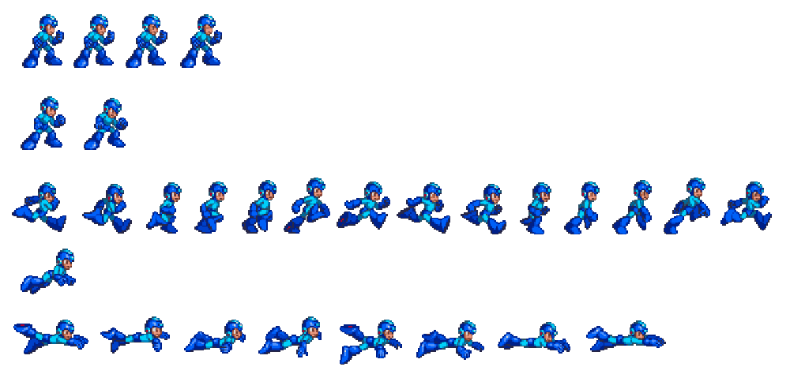
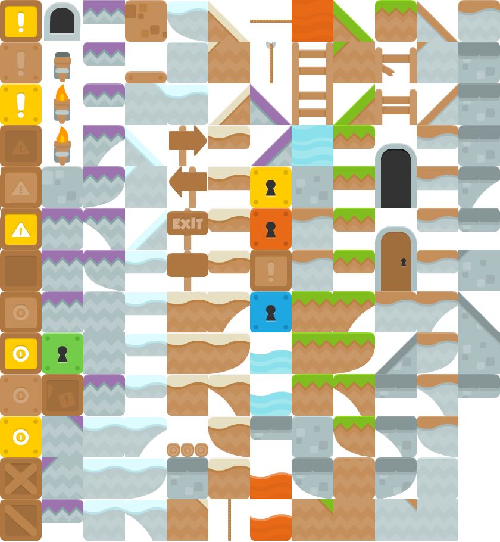
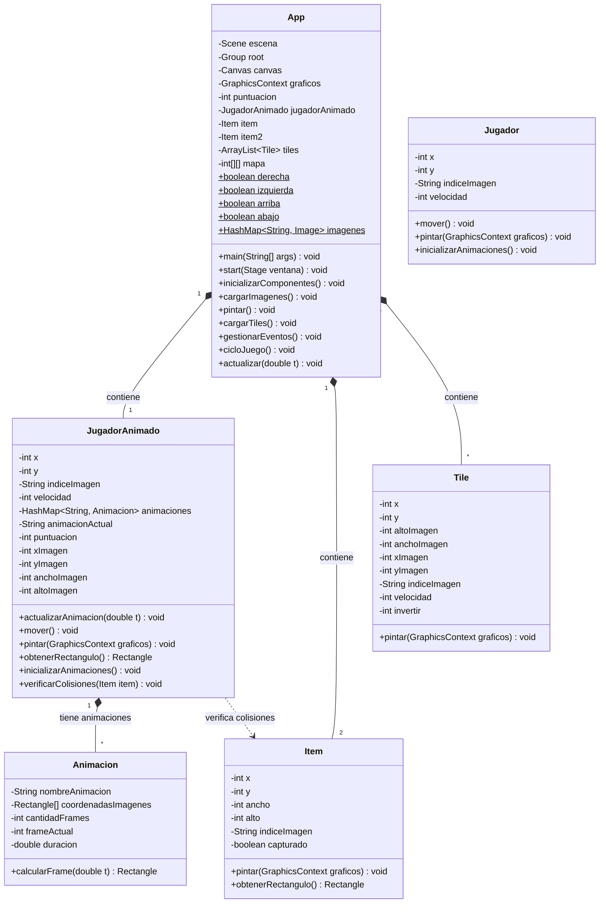
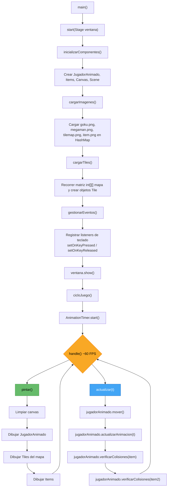

# 🎮 Videojuego Base - JavaFX

Proyecto base para la clase de Programación Orientada a Objetos (POO) de la UNAH. Este proyecto implementa los fundamentos para crear un videojuego 2D utilizando **Java** y **JavaFX**, cubriendo conceptos esenciales como el **game loop**, **animaciones por frames**, **tilemaps** y **detección de colisiones**.

La idea es que los estudiantes utilicen este proyecto como punto de partida para construir su propio videojuego, extendiendo las clases existentes y agregando nuevas funcionalidades.

---

## 📋 Requisitos

- **Java 11** o superior
- **Maven**
- **JavaFX 13** (se descarga automáticamente via Maven)

## ▶️ Cómo ejecutar

```bash
mvn clean javafx:run
```

O bien ejecutar la clase `com.unah.App` directamente desde tu IDE.

---

## 🏗️ Estructura del Proyecto

```
videogame/
├── pom.xml                          # Configuración Maven con dependencias JavaFX
└── src/
    └── main/
        └── java/
            ├── module-info.java     # Módulo Java (requiere javafx.controls y javafx.fxml)
            └── com/
                └── unah/
                    ├── App.java     # Clase principal - Game Loop y configuración
                    ├── goku.png     # Sprite de Goku (estado normal)
                    ├── goku-furioso.png  # Sprite de Goku (estado furioso)
                    ├── megaman.png  # Spritesheet de Megaman (con animaciones)
                    ├── tilemap.png  # Tilemap con los tiles del escenario
                    ├── item.png     # Imagen del item coleccionable
                    └── clases/
                        ├── Animacion.java       # Sistema de animaciones por frames
                        ├── Item.java            # Objetos coleccionables
                        ├── Jugador.java         # Jugador básico (sin animación)
                        ├── JugadorAnimado.java  # Jugador con sistema de animaciones
                        └── Tile.java            # Bloques del escenario (tilemap)
```

---

## 🖼️ Recursos gráficos

El proyecto incluye las siguientes imágenes en `src/main/java/com/unah/`:

| Imagen | Descripción |
|--------|-------------|
| `megaman.png` | **Spritesheet** de Megaman. Contiene múltiples frames organizados en filas para diferentes animaciones (correr, descanso, etc.). Cada frame se recorta en tiempo de ejecución. |
| `tilemap.png` | **Tilemap** con diferentes bloques/tiles de 70x70 píxeles. Se utiliza para construir el escenario del juego recortando regiones específicas de esta imagen. |
| `item.png` | Imagen del **item coleccionable** que el jugador puede recoger para sumar puntuación. |
| `goku.png` | Sprite estático de Goku (ejemplo de personaje sin animación). |
| `goku-furioso.png` | Sprite alternativo de Goku en estado "furioso". |

---

## 📚 Conceptos Clave

### 🔄 Game Loop (Ciclo de Juego)

El **game loop** es el corazón de cualquier videojuego. Es un ciclo infinito que realiza tres tareas fundamentales en cada iteración:

1. **Procesar entrada** (teclado, mouse, etc.)
2. **Actualizar estado** (mover personajes, verificar colisiones)
3. **Renderizar/Pintar** (dibujar todo en pantalla)

En este proyecto, el game loop se implementa en `App.java` usando `AnimationTimer` de JavaFX, que ejecuta su método `handle()` aproximadamente **60 veces por segundo (60 FPS)**:

```java
public void cicloJuego() {
    AnimationTimer animationTimer = new AnimationTimer() {
        @Override
        public void handle(long tiempoActualNanoSegundos) {
            pintar();       // Renderizar
            actualizar(t);  // Actualizar estado
        }
    };
    animationTimer.start();
}
```

### 🎞️ Animaciones basadas en Frames

Las animaciones se logran recortando diferentes regiones (**frames**) de una imagen grande llamada **spritesheet**. Cada frame se muestra por una fracción de segundo, creando la ilusión de movimiento.



Por ejemplo, la animación de "correr" de Megaman usa 13 frames distintos de la fila correspondiente en el spritesheet, cada uno mostrado durante 0.05 segundos.

### 🗺️ Tilemaps

Un **tilemap** es una técnica donde el escenario se construye a partir de pequeños bloques (**tiles**) organizados en una cuadrícula. En lugar de tener una imagen enorme para el mapa, se usa una sola imagen (**tileset**) de la cual se recortan los bloques necesarios.



El mapa se define como una **matriz 2D** donde cada número representa un tipo de tile:

```java
private int[][] mapa = {
    {6,0,0,0,0,0,0},
    {4,0,0,0,0,0,0},
    {4,0,0,0,0,0,0},
    {4,0,0,0,0,0,0},
    {4,0,0,0,0,6,0},
    {4,0,0,2,666,4,0},
    {4,0,0,0,1,4,0},
    {5,0,0,0,0,5,0},
    {0,0,0,0,0,0,0},
    {0,0,0,0,0,0,0}
};
```

- `0` = vacío (no se pinta nada)
- `1`, `2`, `4`, `5`, `6`, `666` = diferentes tiles recortados del tileset

### 💥 Colisiones

La detección de colisiones se realiza comparando los **rectángulos delimitadores** (bounding boxes) de los objetos. Si dos rectángulos se intersectan, hay colisión:

```java
public void verificarColisiones(Item item) {
    if (this.obtenerRectangulo().intersects(item.obtenerRectangulo().getBoundsInLocal())) {
        // ¡Colisión detectada!
        item.setCapturado(true);
        this.puntuacion++;
    }
}
```

---

## 📐 Diagrama de Clases



---

## 🔍 Descripción de Clases

### `App` — Clase Principal

La clase `App` extiende `Application` de JavaFX y es el **punto de entrada** del juego. Aquí se orquesta todo:

| Responsabilidad | Método |
|---|---|
| Configurar la ventana, canvas y escena | `start()`, `inicializarComponentes()` |
| Cargar todas las imágenes en un `HashMap` global | `cargarImagenes()` |
| Construir el mapa a partir de la matriz 2D | `cargarTiles()` |
| Capturar entrada del teclado (flechas, espacio) | `gestionarEventos()` |
| Ejecutar el **game loop** con `AnimationTimer` | `cicloJuego()` |
| Dibujar todos los elementos en cada frame | `pintar()` |
| Actualizar movimiento, animaciones y colisiones | `actualizar()` |

Las teclas presionadas se almacenan en variables estáticas (`derecha`, `izquierda`, `arriba`, `abajo`) que las demás clases consultan para mover al jugador.

---

### `Jugador` — Jugador Básico (sin animación)

Representa un personaje controlable que se mueve con las flechas del teclado y se dibuja usando una **imagen estática completa** (por ejemplo `goku.png`).

- **Movimiento**: Lee las variables estáticas de `App` para determinar la dirección.
- **Renderizado**: Usa `drawImage()` con la imagen completa.
- **Wrapping**: Si el jugador sale por la derecha (x >= 1100), reaparece por la izquierda.

> 💡 Esta clase es una versión simplificada que sirve como introducción antes de pasar a `JugadorAnimado`.

---

### `JugadorAnimado` — Jugador con Animaciones

Versión avanzada del jugador que soporta **múltiples animaciones** basadas en spritesheet. En lugar de dibujar la imagen completa, recorta un **fragmento rectangular** que cambia con el tiempo.

- **Animaciones**: Usa un `HashMap<String, Animacion>` para almacenar animaciones por nombre (`"correr"`, `"descanso"`).
- **Renderizado**: Usa la versión de `drawImage()` con 9 parámetros para recortar y dibujar solo el frame actual del spritesheet.
- **Colisiones**: Genera un `Rectangle` con sus dimensiones actuales y verifica intersección con items.
- **Puntuación**: Lleva un contador interno que incrementa al recoger items.

```java
// drawImage con recorte de spritesheet:
graficos.drawImage(imagen,
    xImagen, yImagen, anchoImagen, altoImagen,  // Región fuente (spritesheet)
    x, y, anchoImagen, altoImagen                // Región destino (pantalla)
);
```

---

### `Animacion` — Sistema de Animación por Frames

Controla la lógica de animación calculando **qué frame mostrar en cada momento** según el tiempo transcurrido.

- **`coordenadasImagenes[]`**: Array de `Rectangle` donde cada rectángulo define la posición (x, y) y tamaño (ancho, alto) de un frame dentro del spritesheet.
- **`duracion`**: Tiempo en segundos que se muestra cada frame (ej: `0.05` = 20 FPS de animación).
- **`calcularFrame(double t)`**: Fórmula clave que determina el frame actual:

```java
frameActual = (int)((t % (cantidadFrames * duracion)) / duracion);
```

Esta fórmula usa el **módulo** para crear un ciclo continuo: cuando llega al último frame, vuelve al primero automáticamente.

---

### `Tile` — Bloque del Escenario

Representa un **bloque individual** del mapa. Cada tile recorta una región específica del tileset (`tilemap.png`) según su tipo.

- **Constructor por tipo**: Recibe un entero (`tipoTile`) y configura las coordenadas de recorte con un `switch`:
  - Tipo `1`: Tile en posición (0, 0) del tileset
  - Tipo `2`: Tile en posición (0, 70)
  - Tipo `4`: Tile en posición (490, 558) — pared lateral
  - Tipo `5`: Tile en posición (560, 558) — esquina
  - Tipo `6`: Tile en posición (560, 698) — esquina superior
  - Tipo `666`: Tile especial en posición (70, 558)
- **Tamaño**: Todos los tiles son de **70×70 píxeles**.
- **Renderizado**: Igual que `JugadorAnimado`, usa `drawImage()` con recorte.

---

### `Item` — Objeto Coleccionable

Representa un **objeto que el jugador puede recoger** (como monedas, estrellas, power-ups, etc.).

- **Estado**: Tiene un booleano `capturado` que controla si ya fue recogido.
- **Renderizado**: Solo se dibuja si **no** ha sido capturado.
- **Colisión**: Genera un `Rectangle` de 18×18 píxeles para detección de colisiones.

---

## 🎯 Flujo de Ejecución



---

## 💡 Ideas para Extender el Proyecto

- **Gravedad y saltos**: Agregar física básica al jugador.
- **Colisiones con tiles**: Evitar que el jugador atraviese las paredes.
- **Enemigos**: Crear una clase `Enemigo` con movimiento autónomo.
- **Niveles**: Cargar diferentes mapas desde archivos externos.
- **Sonido**: Agregar efectos de sonido y música de fondo con `javafx.scene.media`.
- **Menús**: Pantalla de inicio, game over y pausa.
- **Cámara/Scroll**: Mover la vista del mapa cuando el jugador avanza.
- **Más animaciones**: Agregar animaciones de salto, ataque, muerte, etc.
- **Herencia**: Hacer que `JugadorAnimado` extienda de `Jugador` para reutilizar código.

---

## 📝 Notas Técnicas

- Las imágenes se almacenan en un `HashMap<String, Image>` estático en `App` para acceso global.
- El `Canvas` tiene un tamaño de **1000×500 píxeles**.
- La clase `Jugador` está comentada en `App.java` pero disponible como referencia didáctica.
- El proyecto usa **módulos de Java** (`module-info.java`) requiriendo `javafx.controls` y `javafx.fxml`.
