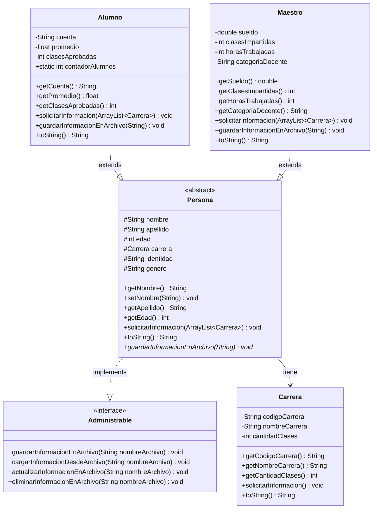
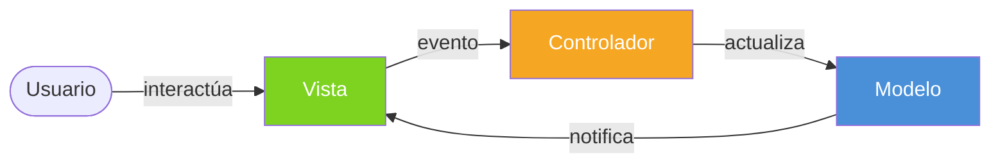
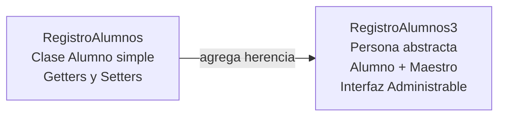

# Programación Orientada a Objetos (POO)
### UNAH — 2026-II

---

## Tabla de Contenidos
1. [Paradigmas de Programación](#1-paradigmas-de-programación)
2. [Java vs. JavaScript](#2-java-vs-javascript)
3. [Herramientas necesarias](#3-herramientas-necesarias)
4. [Tipos de datos y variables en Java](#4-tipos-de-datos-y-variables-en-java)
5. [Funciones y métodos](#5-funciones-y-métodos)
6. [Estándares de codificación](#6-estándares-de-codificación)
7. [Clases y Objetos](#7-clases-y-objetos)
8. [Modificadores de acceso](#8-modificadores-de-acceso)
9. [El modificador `static`](#9-el-modificador-static)
10. [Constructores](#10-constructores)
11. [Encapsulamiento — Getters y Setters](#11-encapsulamiento--getters-y-setters)
12. [Los 4 Pilares de la POO](#12-los-4-pilares-de-la-poo)
13. [Herencia](#13-herencia)
14. [Sobreescritura de métodos](#14-sobreescritura-de-métodos)
15. [Polimorfismo](#15-polimorfismo)
16. [Clases abstractas](#16-clases-abstractas)
17. [Interfaces](#17-interfaces)
18. [Colecciones — ArrayList](#18-colecciones--arraylist)
19. [Interfaces gráficas en Java](#19-interfaces-gráficas-en-java)
20. [Principios SOLID](#20-principios-solid)
21. [Patrón MVC](#21-patrón-mvc)
22. [Control de versiones con Git](#22-control-de-versiones-con-git)
23. [Ejercicios del curso](#23-ejercicios-del-curso)

---

## 1. Paradigmas de Programación

Un **paradigma de programación** es un estilo o enfoque para diseñar y escribir programas. Los principales son:

| Paradigma | Descripción | Lenguajes |
|---|---|---|
| **Procedimental** | El programa se estructura como una secuencia de instrucciones | Pascal, C, Fortran |
| **Funcional** | Se basa en funciones matemáticas puras, sin estado mutable | Haskell, Lisp, Erlang, JavaScript |
| **Orientado a Objetos** | Se organiza en objetos que combinan datos y comportamiento | Java, C++, Python, Ruby, C#, Kotlin |
| **Lógico** | Se define QUÉ resolver, no CÓMO resolverlo | Prolog |

> **Nota:** Muchos lenguajes modernos son **multiparadigma**, como Python o JavaScript, que soportan varios estilos a la vez.

---

## 2. Java vs. JavaScript

Aunque sus nombres son similares, son lenguajes muy diferentes:

| Característica | Java | JavaScript |
|---|---|---|
| **Tipo de ejecución** | Compilado (produce bytecode para la JVM) | Interpretado (ejecutado en el navegador o Node.js) |
| **Tipado** | Fuertemente tipado | Débilmente tipado |
| **Uso principal** | Escritorio, Android, backend empresarial | Web (frontend/backend), apps móviles |

### ¿Qué significa fuertemente tipado?

En **Java**, el tipo de variable se declara explícitamente y no puede cambiar:
```java
int a = 4;
String nombre = "Juan";
double pi = 3.14;
// a = "Hola"; // ERROR — un int no puede ser String
```

En **JavaScript**, la variable se adapta al valor asignado:
```javascript
var a = 4;
var nombre = "Juan";
a = "Hola";      // válido
a = [1, 2, 3];   // también válido
```

### Otros lenguajes compilados vs. interpretados
- **Compilados:** Java, C++, C#, Swift, Kotlin, Go, Rust
- **Interpretados:** JavaScript, Python, Ruby, PHP, Dart

---

## 3. Herramientas necesarias

### 3.1 JDK (Java Development Kit)

El JDK contiene todo lo necesario para desarrollar en Java: el **compilador** (`javac`), la **Máquina Virtual de Java** (JVM) y otras utilidades.

- Descarga oficial: [oracle.com/java](https://www.oracle.com/java/)
- Alternativa gratuita: [OpenJDK](https://openjdk.org/)

**Compilar y ejecutar desde la terminal:**
```bash
# Compilar — genera un archivo .class (bytecode)
javac MiPrograma.java

# Ejecutar el bytecode en la JVM
java MiPrograma
```

### 3.2 IDE (Entorno de Desarrollo Integrado)

Un IDE facilita la escritura, depuración y organización del código. Los más populares para Java:

| IDE | Característica |
|---|---|
| **Eclipse** | Gratuito, muy usado en el ámbito académico |
| **IntelliJ IDEA** | El más popular en la industria |
| **NetBeans** | Gratuito, oficial de Apache |
| **Visual Studio Code** | Ligero, versátil con extensiones |

**Configurar VS Code para Java:**
1. Instalar la extensión **"Extension Pack for Java"**
2. Crear proyecto: `Ctrl + Shift + P` → `Java: Create Java Project`

---

## 4. Tipos de datos y variables en Java

Una **variable** es un espacio en memoria con un nombre para almacenar un valor.

### 4.1 Tipos primitivos

```java
int     numero   = 10;    // Entero
double  decimal  = 3.14;  // Decimal de doble precisión
float   flotante = 1.5f;  // Decimal de precisión simple
byte    byteVal  = 100;   // Entero pequeño (-128 a 127)
boolean esVerdad = true;  // Verdadero o falso
char    caracter = 'A'; // Un solo carácter
```

### 4.2 Tipos no primitivos (Clases)

```java
String texto   = "Hola, mundo!"; // Cadena de texto
int[]  arreglo = {1, 2, 3};      // Arreglo de enteros
```

### 4.3 Constantes

Las constantes usan la palabra clave `final` y su valor **no puede cambiar** una vez asignado:

```java
final double PI           = 3.14159;
final int    MAX_INTENTOS = 3;
```

> **Convención:** las constantes se escriben en **MAYÚSCULAS_CON_GUIÓN_BAJO** (SNAKE_CASE).

---

## 5. Funciones y métodos

Una **función** (o **método** dentro de una clase) es un bloque de código que realiza una tarea específica. Permite reutilizar lógica sin repetir código.

```java
// Declaración de un método
public static int sumar(int a, int b) {
    return a + b;
}

// Llamada al método
int resultado = sumar(5, 3); // resultado = 8
System.out.println("El resultado es: " + resultado);
```

**Anatomía de un método:**
```
[modificador] [tipo_retorno] [nombre]([parámetros]) {
    // cuerpo del método
    return valor; // si el tipo de retorno no es void
}
```

Si un método no devuelve ningún valor, se usa `void`:
```java
public static void saludar(String nombre) {
    System.out.println("Hola, " + nombre + "!");
}
```

---

## 6. Estándares de codificación

Seguir convenciones hace el código más legible y mantenible:

| Elemento | Convención | Ejemplo |
|---|---|---|
| **Clases** | UpperCamelCase | `MiClase`, `RegistroAlumnos` |
| **Métodos** | lowerCamelCase | `calcularPromedio()`, `getNombre()` |
| **Variables** | lowerCamelCase | `edadEstudiante`, `totalRegistros` |
| **Constantes** | UPPER_SNAKE_CASE | `MAX_ALUMNOS`, `TASA_IVA` |
| **Paquetes** | todo minúsculas | `principal`, `clases`, `interfaces` |

---

## 7. Clases y Objetos

### ¿Qué es una Clase?

Una **clase** es una **plantilla o molde** que define las características (atributos) y comportamientos (métodos) de un tipo de entidad. Es, en esencia, un nuevo tipo de dato.

### ¿Qué es un Objeto?

Un **objeto** es una **instancia concreta** de una clase. Se crea usando la palabra clave `new`.

```java
public class Computadora {
    String marca;
    String modelo;
    String procesador;
    int    memoriaRAM;
    int    almacenamiento;

    public void encender() {
        System.out.println("La computadora se ha encendido.");
    }

    public void ejecutarPrograma(String programa) {
        System.out.println("Ejecutando: " + programa);
    }
}
```

```java
// Crear un objeto (instanciar) la clase
Computadora miPC = new Computadora();
miPC.marca     = "Dell";
miPC.memoriaRAM = 16;
miPC.encender();
```

**Otras clases del mundo real:**

| Clase | Atributos | Métodos |
|---|---|---|
| `Carro` | marca, modelo, año, color | `acelerar()`, `frenar()`, `encender()` |
| `Animal` | especie, edad, color, peso | `comer()`, `moverse()`, `emitirSonido()` |
| `Libro` | título, autor, año, páginas | `abrirPagina()`, `cerrar()` |
| `Persona` | nombre, edad, género, altura | `hablar()`, `caminar()`, `comer()` |

> **Clave:** Una clase es un tipo de dato. Así como `int` almacena números, `Alumno` almacena información de un alumno.

---

## 8. Modificadores de acceso

Controlan quién puede ver o usar los atributos y métodos de una clase:

| Modificador | Misma clase | Mismo paquete | Subclases | Cualquier clase |
|---|:---:|:---:|:---:|:---:|
| `public` | ✅ | ✅ | ✅ | ✅ |
| `protected` | ✅ | ✅ | ✅ | ❌ |
| *(sin modificador)* | ✅ | ✅ | ❌ | ❌ |
| `private` | ✅ | ❌ | ❌ | ❌ |

```java
public class Ejemplo {
    public    String nombre;    // accesible desde cualquier lado
    protected int    edad;      // accesible en el paquete y subclases
    private   double saldo;     // solo dentro de esta clase
              String ciudad;    // solo dentro del mismo paquete
}
```

---

## 9. El modificador `static`

El modificador `static` indica que un miembro (atributo o método) **pertenece a la clase** en lugar de a una instancia específica.

- Los miembros estáticos son **compartidos** por todas las instancias de la clase.
- Se pueden acceder **sin crear un objeto**, usando directamente el nombre de la clase.
- Cualquier cambio en un atributo estático afecta a todas las instancias.

```java
public class Alumno {
    public static int contadorAlumnos = 0; // compartido entre todos los objetos

    public Alumno() {
        contadorAlumnos++; // cada vez que se crea un alumno, el contador sube
    }
}

// Acceso sin crear objeto:
System.out.println(Alumno.contadorAlumnos);

// Tanto alumno1 como alumno2 comparten el mismo contadorAlumnos
Alumno alumno1 = new Alumno(); // contadorAlumnos = 1
Alumno alumno2 = new Alumno(); // contadorAlumnos = 2
System.out.println(Alumno.contadorAlumnos); // 2
```

> El método `main` también es `static` porque Java necesita ejecutarlo **sin crear un objeto** de la clase principal.

---

## 10. Constructores

Un **constructor** es un método especial que se ejecuta automáticamente al crear un objeto con `new`. Sirve para inicializar los atributos del objeto.

**Reglas:**
- Tiene el **mismo nombre** que la clase
- **No tiene tipo de retorno** (ni `void`)
- Si no se define ninguno, Java provee uno vacío por defecto

```java
public class Alumno {
    private String nombre;
    private int    edad;

    // Constructor sin parámetros
    public Alumno() {
        System.out.println("Se creó un nuevo Alumno.");
    }

    // Constructor con parámetros
    public Alumno(String nombre, int edad) {
        this.nombre = nombre; // "this" = el atributo del objeto
        this.edad   = edad;
    }
}

// Uso:
Alumno a1 = new Alumno();             // constructor vacío
Alumno a2 = new Alumno("María", 20);  // constructor con parámetros
```

> **`this`** distingue el atributo del objeto del parámetro del constructor cuando tienen el mismo nombre.

### Llamar al constructor padre con `super()`

Cuando una clase hereda de otra, puede llamar al constructor del padre con `super()`:

```java
public class Alumno extends Persona {
    private String cuenta;

    public Alumno(String nombre, String apellido, int edad, String cuenta) {
        super(nombre, apellido, edad); // llama al constructor de Persona
        this.cuenta = cuenta;
    }
}
```

---

## 11. Encapsulamiento — Getters y Setters

El **encapsulamiento** consiste en declarar los atributos como `private` y exponer su acceso controlado mediante métodos públicos:
- **Getter** (`get...`): devuelve el valor de un atributo
- **Setter** (`set...`): establece el valor de un atributo

```java
public class Alumno {
    private String nombre;
    private int    edad;

    public String getNombre() {      // getter
        return this.nombre;
    }

    public void setNombre(String nombre) { // setter
        this.nombre = nombre;
    }

    public int getEdad() {
        return edad;
    }

    public void setEdad(int edad) {
        if (edad > 0) {              // validación antes de asignar
            this.edad = edad;
        }
    }
}
```

```java
Alumno a = new Alumno();
a.setNombre("Carlos");
a.setEdad(21);
System.out.println(a.getNombre()); // Carlos
```

> **¿Por qué encapsular?** Protege los datos y permite agregar validaciones sin que el resto del programa deba cambiar.

---

## 12. Los 4 Pilares de la POO

| Pilar | Descripción |
|---|---|
| **Encapsulamiento** | Ocultar detalles internos; acceso solo a través de métodos públicos |
| **Abstracción** | Modelar solo los aspectos relevantes, ignorando detalles innecesarios |
| **Herencia** | Una clase hija reutiliza atributos y métodos de una clase padre |
| **Polimorfismo** | Un objeto puede tomar distintas formas según el contexto |

---

## 13. Herencia

La **herencia** permite crear una nueva clase (**subclase** o clase hija) que reutiliza los atributos y métodos de una clase existente (**superclase** o clase padre). La subclase puede agregar nuevos miembros o modificar los heredados.

**Palabras clave:**
- `extends` → para heredar de una clase
- `super` → para acceder al constructor o métodos de la clase padre
- `instanceof` → para verificar si un objeto es instancia de una clase

```java
// Clase padre
public class Persona {
    protected String nombre;
    protected int    edad;

    public Persona(String nombre, int edad) {
        this.nombre = nombre;
        this.edad   = edad;
    }
}

// Clase hija — hereda nombre y edad de Persona
public class Alumno extends Persona {
    private String cuenta;
    private double promedio;

    public Alumno(String nombre, int edad, String cuenta, double promedio) {
        super(nombre, edad);      // llama al constructor de Persona
        this.cuenta   = cuenta;
        this.promedio = promedio;
    }
}

public class Maestro extends Persona {
    private double sueldo;

    public Maestro(String nombre, int edad, double sueldo) {
        super(nombre, edad);
        this.sueldo = sueldo;
    }
}
```

> **Regla importante:** Java solo permite **herencia simple** — una clase solo puede `extends` de una única clase padre. Sin embargo, puede implementar múltiples interfaces.

> **Dato:** Todas las clases en Java heredan implícitamente de `Object`, la superclase raíz, que provee métodos como `toString()`, `equals()` y `hashCode()`.

### Diagrama de herencia — Proyecto RegistroAlumnos3

El proyecto [RegistroAlumnos3](RegistroAlumnos3/src/) demuestra herencia, clases abstractas e interfaces con 4 clases:



**Leyenda del diagrama:**
- `+` → `public` &nbsp; `-` → `private` &nbsp; `#` → `protected`
- `*` al final de un método → método **abstracto**
- `--|>` → herencia (`extends`)
- `..|>` → implementación (`implements`)
- `-->` → asociación (tiene una referencia)

---

## 14. Sobreescritura de métodos

La **sobreescritura** (`@Override`) permite que una subclase redefina un método heredado de su superclase, dándole su propia implementación.

**Requisitos:**
- Mismo nombre de método
- Mismo tipo de retorno
- Mismos parámetros

```java
public class Persona {
    public void hablar() {
        System.out.println("La persona está hablando.");
    }

    @Override
    public String toString() {
        return "Nombre: " + nombre + ", Edad: " + edad;
    }
}

public class Alumno extends Persona {
    @Override
    public void hablar() {
        System.out.println("El alumno está hablando.");
    }

    @Override
    public String toString() {
        return "Cuenta: " + cuenta + ", " + super.toString();
    }
}
```

> La anotación `@Override` es opcional pero **recomendada**: hace explícita la intención y el compilador verifica que realmente se está sobreescribiendo un método existente.

> `super.toString()` llama a la implementación del método en la clase padre, evitando repetir código.

---

## 15. Polimorfismo

El **polimorfismo** (del griego *poli* = muchos, *morfismo* = formas) es la capacidad de un objeto de una clase hija de ser tratado como si fuera de la clase padre.

Esto permite que el **mismo código** opere sobre objetos de diferentes clases, invocando el comportamiento correcto según el tipo real del objeto.

```java
// Los tres son tratados como Persona, pero cada uno se comporta diferente
Persona p1 = new Alumno();   // referencia Persona → objeto Alumno
Persona p2 = new Maestro();  // referencia Persona → objeto Maestro

p1.hablar(); // "El alumno está hablando."
p2.hablar(); // "El maestro está hablando."

// No se puede instanciar Persona si es abstracta:
// Persona p3 = new Persona(); // ERROR
```

**Uso práctico — lista polimórfica:**
```java
ArrayList<Persona> personas = new ArrayList<>();
personas.add(new Alumno());
personas.add(new Maestro());
personas.add(new Alumno());

for (Persona p : personas) {
    p.guardarInformacionEnArchivo("datos.txt"); // cada uno guarda a su manera
}

// Verificar tipo real con instanceof
for (Persona p : personas) {
    if (p instanceof Alumno) {
        System.out.println("Es un alumno");
    } else if (p instanceof Maestro) {
        System.out.println("Es un maestro");
    }
}
```

---

## 16. Clases abstractas

Una **clase abstracta** no puede instanciarse directamente (no se puede hacer `new ClaseAbstracta()`). Sirve como base para otras clases, definiendo una estructura común.

**Características:**
- Se declara con la palabra clave `abstract`
- Puede contener métodos **abstractos** (sin cuerpo) que las subclases **deben** implementar obligatoriamente
- Puede contener métodos **concretos** (con implementación) que las subclases heredan directamente
- Puede tener constructores (llamados con `super()` desde las subclases)
- Si una clase tiene al menos un método abstracto, **debe** declararse abstracta

```java
public abstract class Persona {
    protected String nombre;
    protected String apellido;

    // Constructor — solo llamable desde subclases con super()
    public Persona(String nombre, String apellido) {
        this.nombre   = nombre;
        this.apellido = apellido;
    }

    // Método concreto — heredado tal cual
    public void mostrarNombreCompleto() {
        System.out.println(this.nombre + " " + this.apellido);
    }

    // Método abstracto — cada subclase DEBE implementarlo
    public abstract void guardarInformacionEnArchivo(String nombreArchivo);
}
```

```java
// Subclase concreta — implementa el método abstracto
public class Alumno extends Persona {
    @Override
    public void guardarInformacionEnArchivo(String nombreArchivo) {
        System.out.println("Guardando alumno en: " + nombreArchivo);
    }
}

// Persona p = new Persona(); // ERROR — no se puede instanciar
Persona p = new Alumno();     // OK — polimorfismo
```

---

## 17. Interfaces

Una **interfaz** es un contrato que define un conjunto de métodos que una clase **debe** implementar. Es similar a una clase abstracta pero más restrictiva y flexible.

**Diferencias clave con clases abstractas:**

| Característica | Clase abstracta | Interfaz |
|---|---|---|
| Instanciación | No | No |
| Métodos con cuerpo | Sí | Solo `default` y `static` (Java 8+) |
| Atributos | Sí (cualquier tipo) | Solo `public static final` (constantes) |
| Herencia múltiple | No (`extends` 1 sola) | Sí (`implements` varias) |
| Constructores | Sí | No |

```java
public interface Administrable {
    // Constante (implícitamente public static final)
    String NOMBRE_ARCHIVO_DEFAULT = "datos.txt";

    // Métodos abstractos (implícitamente public abstract)
    void guardarInformacionEnArchivo(String nombreArchivo);
    void cargarInformacionDesdeArchivo(String nombreArchivo);
    void actualizarInformacionEnArchivo(String nombreArchivo);
    void eliminarInformacionEnArchivo(String nombreArchivo);
}
```

**Implementar una interfaz:**
```java
// Una clase puede implementar MÚLTIPLES interfaces
public abstract class Persona implements Administrable {
    // Debe implementar todos los métodos de la interfaz
    // (o declararlos abstractos para que las subclases los implementen)
}

public class Alumno extends Persona implements Administrable, Serializable {
    @Override
    public void guardarInformacionEnArchivo(String nombreArchivo) {
        System.out.println("Guardando alumno en: " + nombreArchivo);
    }
    // ... implementar los demás métodos
}
```

**Usos comunes de las interfaces:**
- Definir un contrato que múltiples clases no relacionadas deben cumplir
- Simular herencia múltiple
- Implementar listeners o manejadores de eventos (GUI)
- Patrones de diseño (Estrategia, Observador, etc.)

---

## 18. Colecciones — ArrayList

Un `ArrayList` es una lista **dinámica** (puede crecer o reducirse) que almacena objetos de un tipo específico.

```java
import java.util.ArrayList;

// Declaración
ArrayList<Alumno> alumnos = new ArrayList<>();

// Agregar elementos
Alumno a1 = new Alumno();
a1.solicitarInformacion(carreras);
alumnos.add(a1);

// Acceder a un elemento por índice
Alumno primero = alumnos.get(0);

// Recorrer la lista
for (Alumno a : alumnos) {
    System.out.println(a.getNombre());
}

// Tamaño de la lista
System.out.println("Total: " + alumnos.size());

// Eliminar un elemento
alumnos.remove(0);
```

> `<>` es el **operador diamante** (*generics*): define el tipo de objeto que almacenará la lista.

**Comparación con arreglos estáticos:**
```java
// Arreglo — tamaño fijo, definido al crear
Alumno[] arreglo = new Alumno[5];

// ArrayList — tamaño dinámico, crece según se necesite
ArrayList<Alumno> lista = new ArrayList<>();
```

**Lista polimórfica (almacena padres e hijos):**
```java
// Al declarar ArrayList<Persona>, se pueden agregar Alumno y Maestro
ArrayList<Persona> personas = new ArrayList<>();
personas.add(new Alumno());
personas.add(new Maestro());
```

---

## 19. Interfaces gráficas en Java

Java ofrece varios paquetes para crear ventanas y formularios:

| Paquete | Descripción |
|---|---|
| `java.awt.*` | AWT — Abstract Window Toolkit (básico, nativo del SO) |
| `javax.swing.*` | Swing — más completo, componentes propios de Java |
| `javafx.*` | JavaFX — moderno, soporta CSS y FXML |

### JOptionPane — Diálogos rápidos con Swing

```java
import javax.swing.JOptionPane;

// Mostrar un mensaje
JOptionPane.showMessageDialog(null, "¡Hola, mundo!");

// Pedir un dato al usuario
String nombre = JOptionPane.showInputDialog("¿Cuál es tu nombre?");

// Convertir String a int
int edad = Integer.parseInt(JOptionPane.showInputDialog("¿Cuántos años tienes?"));

// Convertir String a double
double promedio = Double.parseDouble(JOptionPane.showInputDialog("¿Cuál es tu promedio?"));

// Mostrar un objeto (llama a su método toString())
Alumno a = new Alumno();
JOptionPane.showMessageDialog(null, a);
```

---

## 20. Principios SOLID

**SOLID** es un acrónimo de cinco principios de diseño orientado a objetos que ayudan a crear código más mantenible, flexible y escalable:

| Letra | Principio | Descripción |
|---|---|---|
| **S** | *Single Responsibility* | Una clase debe tener **una sola responsabilidad** (razón para cambiar) |
| **O** | *Open/Closed* | Las clases deben estar **abiertas para extensión** pero **cerradas para modificación** |
| **L** | *Liskov Substitution* | Una subclase debe poder **sustituir** a su superclase sin romper el programa |
| **I** | *Interface Segregation* | Es mejor tener **muchas interfaces específicas** que una interfaz grande y general |
| **D** | *Dependency Inversion* | Depender de **abstracciones**, no de implementaciones concretas |

**Ejemplo de S (Responsabilidad Única):**
```java
// MAL: una clase hace demasiado
public class Alumno {
    public void guardarEnBaseDeDatos() { ... }
    public void enviarEmail() { ... }
    public void generarReporte() { ... }
}

// BIEN: cada clase tiene una responsabilidad
public class Alumno { /* solo datos del alumno */ }
public class AlumnoRepository { public void guardar(Alumno a) { ... } }
public class EmailService { public void enviar(String dest) { ... } }
}
```

---

## 21. Patrón MVC

**Modelo-Vista-Controlador (MVC)** es un patrón de diseño que separa una aplicación en tres capas:



| Capa | Responsabilidad | Ejemplo en Java |
|---|---|---|
| **Modelo** | Datos y lógica de negocio | Clases `Alumno`, `Maestro`, `Carrera` |
| **Vista** | Presentación e interfaz de usuario | `JOptionPane`, formularios Swing, JavaFX |
| **Controlador** | Coordina Modelo y Vista, maneja eventos | Clase `App`, métodos del menú |

**Ventajas:**
- Separación clara de responsabilidades
- Facilita el trabajo en equipo (un dev en Vista, otro en Modelo)
- El Modelo puede probarse sin una interfaz gráfica
- Cambiar la Vista no afecta al Modelo

---

## 22. Control de versiones con Git

**Git** (creado por Linus Torvalds) es el sistema de control de versiones más utilizado en el mundo.

### Plataformas en la nube

| Plataforma | URL |
|---|---|
| GitHub | github.com |
| GitLab | gitlab.com |
| Bitbucket | bitbucket.org |

### Comandos esenciales

```bash
# Inicializar un repositorio
git init

# Ver el estado actual
git status

# Agregar archivos al área de preparación (staging)
git add NombreArchivo.java
git add .                        # todos los archivos

# Guardar los cambios (commit)
git commit -m "Descripción del cambio"

# Ver las ramas existentes
git branch

# Subir cambios al repositorio remoto
git push

# Traer cambios del repositorio remoto
git pull

# Clonar un repositorio existente
git clone https://github.com/usuario/repositorio.git
```

### Ramas (Branches)

Las **ramas** permiten trabajar en diferentes versiones del proyecto de forma simultánea sin afectar la rama principal (`main`).

```bash
git branch nueva-funcionalidad       # crear rama
git checkout nueva-funcionalidad     # cambiarse a esa rama
git merge nueva-funcionalidad        # fusionar con la rama actual
```

---

## 23. Ejercicios del curso

| Proyecto | Archivos principales | Conceptos demostrados |
|---|---|---|
| **Hola Mundo (básico)** | [HolaMundo.java](HolaMundo.java) | Primer programa, `System.out.println` |
| **Hola Mundo Eclipse** | [HolaMundo.java](HolaMundoEclipse/src/principal/HolaMundo.java) | Eclipse, `JOptionPane` |
| **Hola Mundo VS Code** | [App.java](HolaMundoVSCode/HolaMundo/src/principal/App.java) | Variables, tipos de datos, métodos |
| **Registro de Alumnos** | [Alumno.java](RegistroAlumnos/src/clases/Alumno.java) | Clases, objetos, encapsulamiento, ArrayList |
| **Registro de Alumnos 3** | [Persona.java](RegistroAlumnos3/src/clases/Persona.java) · [Alumno.java](RegistroAlumnos3/src/clases/Alumno.java) · [Maestro.java](RegistroAlumnos3/src/clases/Maestro.java) · [Administrable.java](RegistroAlumnos3/src/interfaces/Administrable.java) | Herencia, clases abstractas, interfaces, polimorfismo, `static`, `@Override` |

### Evolución del proyecto RegistroAlumnos



### RegistroAlumnos3 — Puntos clave del código

**Clase abstracta `Persona` implementa la interfaz `Administrable`:**
```java
public abstract class Persona implements Administrable {
    protected String nombre;   // protected: accesible en subclases
    protected Carrera carrera; // asociación con la clase Carrera

    public abstract void guardarInformacionEnArchivo(String nombreArchivo);
}
```

**`Alumno` extiende `Persona` y usa `super()` + `@Override`:**
```java
public class Alumno extends Persona {
    public static int contadorAlumnos = 0; // compartido entre todos los alumnos

    public Alumno(String nombre, String apellido, int edad,
                  Carrera carrera, String identidad, String genero,
                  String cuenta, float promedio, int clasesAprobadas) {
        super(nombre, apellido, edad, carrera, identidad, genero);
        this.cuenta = cuenta;
    }

    @Override
    public void solicitarInformacion(ArrayList<Carrera> carreras) {
        this.cuenta = JOptionPane.showInputDialog("Número de cuenta:");
        super.solicitarInformacion(carreras); // llama a la lógica común
    }

    @Override
    public String toString() {
        return "Cuenta: " + cuenta + ", " + super.toString();
    }
}
```

**Polimorfismo en `App.java`:**
```java
Persona p1 = new Alumno();   // objeto Alumno tratado como Persona
Persona p2 = new Maestro();  // objeto Maestro tratado como Persona

ArrayList<Persona> personas = new ArrayList<>();
personas.add(p1);
personas.add(p2);

// Cada persona llama su propia implementación de guardarInformacionEnArchivo()
for (Persona p : personas) {
    p.guardarInformacionEnArchivo("registro.txt");
}
```

---

## Recursos recomendados

- [Documentación oficial de Java (Oracle)](https://docs.oracle.com/en/java/)
- [OpenJDK](https://openjdk.org/)
- [W3Schools Java Tutorial](https://www.w3schools.com/java/)
- [Codecademy — Learn Java](https://www.codecademy.com/learn/learn-java)
- [Mermaid — Diagramas en Markdown](https://mermaid.js.org/)

---

*Elaborado para el curso de Programación Orientada a Objetos — UNAH 2026-II*